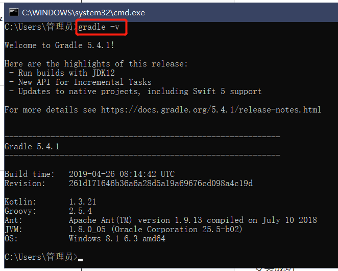
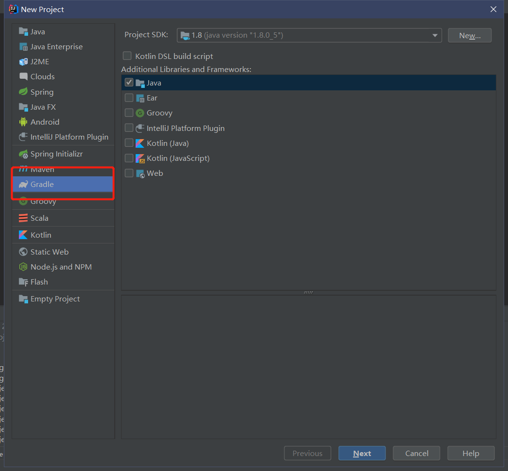
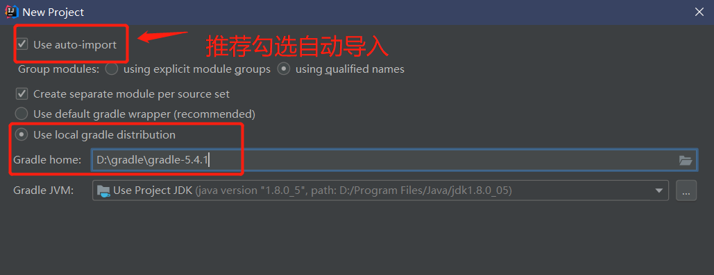

# Gradle工具使用

## 安装Gradle


下载：<https://gradle.org/releases/>

配置环境变量：


path配置


安装成功



## 使用IDEA创建Gradle项目

第一步：



第二步：


第三步：



第四步：


创建完成

## 介绍Groovy编程语言[了解]

第一步通过IDEA打开Grovvy编程页面


### 基本输出语句

```groovy
//介绍groovy编程语言
println("hello grovvy");
//grovvy可以省略最末尾的分号。
println("hello grovvy")
//可以省略括号
println "hello grovvy"
```

### 定义变量

```groovy
//groovy中定义变量
//def是弱类型的，groovy会自动更具情况来给变量赋予对应的类型
def i= 18;
println i
def s="肖杰斌"
println(s)
```

### 定义集合类型

```groovy
//定义集合类型
def list = ['a','b']
//添加一个元素
list << 'c'
//取出list中第三个原色
println(list.get(2))
```

### 定义一个map

```groovy
//定义一个map
def map = ['key1':'value1','key2':'value2']
//向map中添加键值对
map.key3='value3'
//get出入参数必须使用""
println map.get("key3")
```

### 定义闭包

```groovy
//groovy中的闭包
//什么是闭包？闭包其实就是一段代码块，在Gradle中，我们主要是把闭包当参数来使用。
//定义一个闭包
def b1={
    println "hello b1"
}
//定义你一个方法，方法里面需要闭包类型的参数
def method1(Closure closure){
    closure("小马")
}
//调用method1方法
method1(b1);

//定义一个闭包，带参数
def b2 ={
    v ->
        println "hello ${v}"
}
method1(b2)
```

​	

## Gradle本地仓库以及配置文件

#### 配置本地仓库


#### 配置文件详解

```groovy
plugins {
    id 'java'
}

group 'com.xiao.demo'
version '1.0-SNAPSHOT'

sourceCompatibility = 1.8

/**
 * 指定仓库的路径,mavenCentral()表示使用中央仓库，mavenLocal表示从本地仓库找，如果没有再从中央仓库找
 * 刺客项目中所需要的jar包都会默认从中央仓库下载到本地指定目录
 */
repositories {
    mavenLocal()
    mavenCentral()
}

/**
 * gradle工程所有的jar包的坐表都在dependencies属性内房子
 * 每一个jar包的坐表都有三个基本元素组成
 * group,name,version
 * testCompile表示该jar包在测试的时候起作用，该属性为jar包的作用域
 * 在gradle里面添加坐表的时候都要带上jar包的作用域。
 */
dependencies {
    testCompile group: 'junit', name: 'junit', version: '4.12'
    // https://mvnrepository.com/artifact/org.springframework/spring-context
    compile group: 'org.springframework', name: 'spring-context', version: '5.1.5.RELEASE'

}

```

