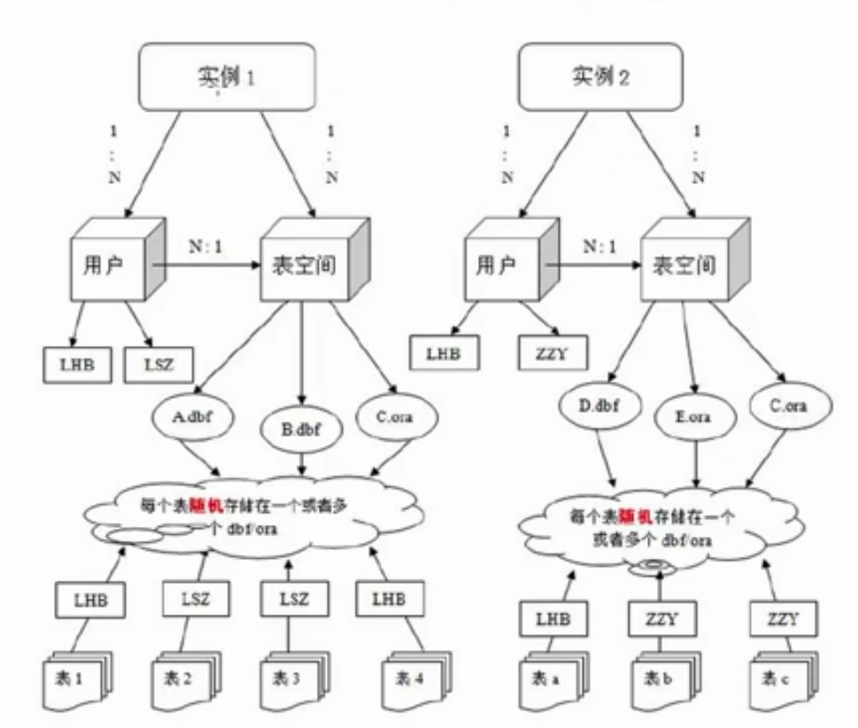

# Oracle体系结构

​	Oracle的体系结构是指数据库的组成、工作过程与原理，以及数据在数据库中组织与管理机制

​	Oracle服务器提供开发、全面和综合的信息管理，它由Oracle数据库和Oracle实例组成

​			1.数据库：物理操作系统文件或磁盘的集合

​			2.实例：管理数据库的后台进程和内存结构的集合。有一组ORACLE后台进程/线程以及一个共享内存区组成。

​			3.用户： 是在实例下简历的。不同势力可以建相同名字的用户

​			4.表空间：表空间是Oracle对物理数据库上相关数据文件(ORA或者DBF文件)的逻辑映射。一个数句酷在逻辑上被划分成一到若干个表空间，每个表空间包含了在逻辑上相关联的一组结构。每个数据库至少有一个表空间(称之为system表空间)。

​			5.数据文件(dbf、ora)：数据文件是数据库的物理存储单位。数据库的数据时存储在表空间中的，真正是在某一个或者多个数据文件中。而一个表空间可以由一个或多个数据文件组成，一个数据文件只能属于一个表空间。一旦数据文件被加入到某个表空间之后，就不能删除这个文件，如果要删除某个数据文件，只能删除其所属于的表空间才行。

​			注：表的数据，是有用户放入某一个表空间的，而这个表空间会随机把这些表数据放到一个或者多个数据文件中。



# Oracle网络配置

​	Oracle产品安装完成后，服务器和客户端都需要进行网络配置才能实现网络连接。**服务器端配置监听器**，**客户端配置网络服务名。**

​	服务端监听器配置信息包括`监听协议`、`地址`及其他相关信息。

​	配置信息保存在名为`listener.ora`的文件中在安装服务器软件是自动配置一个监听器

​	客户端的网络服务名配置信息包括`服务器地址`、`监听端口号`和`数据库SID`等，与服务器的监听器建立连接。

​	配置信息报错在名为`tnsnames.ora`的文件中

Oracle中的Net Configuration Assistant和Net Manager工具都能用来配置监听器和网络服务名

# Oracle的默认用户

​	只有合法的用户账号磁能访问Oracle数据库，Oracle有几个默认的数据库用户：sys、system、scott

​	连接数据库需要用户账号，每个用户拥有表空间和一个临时表空间。

```sql
create user <userneme> identified by <password>
default tablespace users
temporary tablespace temp;
```


# SQL分类

```txt
数据定义语言：简称DDL（Data Definition Language）,来定义数据库对象：数据库database，表table，列column等。关键字create，修改alter，删除drop等（结构）

数据操作语言简称DML（Data Manipulation Language），用来对数据库中表的记录进行更新。关键字：插入insert，删除delete，更新update等（数据）

数据查询语句：简称DQL（Date Query Language），用来查询数据库中表的记录。关键字：select，from，where等

数据控制语言：简称DCL（Date Control Language），用来定义数据库的访问权限和安全级别，及创建用户：关键字：grant等
```

# 基本操作

```sql
//通过CMD连接ORCLE
sqlplus [用户]/[密码]

//退出
exit

//查看当前数据库实例
show user

```

# 表空间和用户

## 创建表空间以及删除表空间

```sql
-- 创建表空间
create tablespace itheima
datafile 'E:\oracle\itheima.dbf' --指定目录
size 100m
autoextend on 
next 10m; --每次增长的大小为10m

-- 删除表空间
drop tablespace itheima;
```

## 创建用户以及给用户授予权限

```sql
-- 创建用户
create user itheima   -- 用户
identified by itheima -- 密码
default tablespace itheima; --指定表空间

-- 给用户授权，否则无法登陆
-- Oracle数据库中常用角色
-- connect --连接角色，基本角色
-- resource --开发者角色
-- dba --超级管理员角色

-- 给 itheima用户授予dba角色
grant dba to itheima;
```


# Oracle表


## Oracle数据类型[应用]

 

| No   | 数据类型         | 描述                                                         |
| ---- | ---------------- | :----------------------------------------------------------- |
| 1    | Varchar,Varchar2 | 表示一个字符串                                               |
| 2    | NUMBER           | NUMBER(N)表示一个整数，长度是N<br />NUMBER(M,N)表示一个小数，总长度是M，小数是N，证书是M-N |
| 3    | DATA             | 表示日期类型                                                 |
| 4    | CLOB             | 大对象，表示大文本数据类型，可存4G                           |
| 5    | BLOB             | 大对象，表示二进制数据，可存4G                               |

## 创建数据表

```sql
-- 创建一个person表
create table person(
       pid number(20),
       pname varchar2(10)
);
```

## 数据表操作

```sql
-- 修改表结构
--添加一列
alter table person add (genders number(1),sex number(1));
--修改列类型
alter table person modify gender char(1);
-- 修改列名称
alter table person rename column gender to sex;
-- 删除一列
alter table person drop column sex;
```

## 数据的增删改查

```sql
-- 注意：在Oracle执行增删改时，需要手动提交事务。否则会出现脏数据。
--查询表中记录
select * from person;
--添加一条记录
insert into person (pid,pname) values(1,'小明');
--修改一条记录
update person set pname ='小马' where pid = 1;
--删除记录
-- delete(删除表中全部记录)，drop(删除表结构)，truncate(先删除表，再次创建表。效果等同于删除表中全部记录)
-- 在数据量大的情况下，尤其在表中带有索引的情况下，truncate效率高。
-- 索引可以提高查询效率，但是会影响增删改效率。
delete table person;
drop table person;
truncate table person;
commit;
```

## 序列

```sql
-- 序列不属于任何一张表，但是可以逻辑和表做绑定
-- 序列：默认从1开始，依次递增，主要用来给主键赋值使用。
-- dual:虚标，只是为了补全语法，没有任何意义。
create sequence s_person;
select s_person.nextval from dual;
insert into person (pid,pname) values(s_person.nextval,'小马');
```

## Scott用户

```sql
--scott用户，密码tiger。
-- 解锁Scott用户
alter user scott account unlock;
-- 解锁scott用户的密码
alter user scott identified by tiger;
```

# Oracle查询

## 单行函数

```text
作用于一行，返回一个值。
```

### 字符函数

```sql
-- 字符函数
select upper('yes') from dual; --小写变大写
select lower('YES') from dual; --大写变小写
```

### 数值函数

```sql
-- 数值函数
select round(26.18,1) from dual; --四舍五入，后面的参数表示保留的小数
select trunc(56.16,1) from dual; --直接截取，不在看后面小数是否大于五
select mod(10,3) from dual;      --求余数
```

### 日期函数

```sql
-- 日期函数
-- 查询出emp表中所有员工入职距离现在几天
select sysdate-e.hiredate from emp e;
-- 算出明天此刻
select sysdate+1 from dual;
-- 查询出emp表中所有员工入职距离现在几月
select months_between(sysdate,e.hiredate)/12 from emp e;
-- 查询出emp表中所有员工入职距离现在几周
select round((sysdate-e.hiredate)/7) from emp e;
```

### 转换函数

```sql
-- 转换函数
select to_char(sysdate,'fm yyyy-mm-dd hh24:mi:ss') from dual; -- 日期转字符创
select to_date('2019-5-20 14:21:30','fm yyyy-mm-dd hh24:mi:ss') from dual; -- 字符串转日期
```

### 通用函数

```sql

-- 通用函数
-- 算出emp表中所有员工的年薪
-- 奖金里面有null值，如果null值和任意数字做算数运算，结果多是null
select e.sal*12+nvl(e.comm,0) from emp e; --nvl函数，如果为null，就是0，否则为本身

-- 条件表达式,条件表达式通用写法，oracle和mysql通用
--给emp表中员工起中英文名
select e.ename,
       case e.ename
         when 'SMITH' then '曹贼'
         when 'ALLEN' then '诸葛小儿'
         else '无名' -- 可省略
         end
 from emp e;
 
 -- 判断emp表中员工工资，如果高于3000显示高收入，
 --如果高于1500低于3000显示中等收入，低于1500，低收入
 select e.sal,
       case 
         when e.sal>3000 then '高收入'
         when e.sal>1500 then '中收入'
         else '低收入' -- 可省略
         end
 from emp e;
 
 -- oracle中除了起别名使用双引号，其他多用单引号。
 --	oracle专用条件表达式
  select e.sal,
        decode( e.ename,
          'SMITH' , '曹贼',
          'ALLEN' , '诸葛小儿',
          '无名' -- 可省略
         ) "中文名" -- 此列别名，可用双引号
 from emp e;
```


## 多行函数

```txt
作用于多行，返回一个值。
```

### 聚合函数

```sql
--【聚合函数】 ：作用于多行，返回一个值。
 select count(1) from emp; --查询总数量
 select sum(sal) from emp; --工资总和
 select max(sal) from emp; --最大工资
 select min(sal) from emp; --最低工资
 select avg(sal) from emp; --平均工资
```

### 分组查询

```sql
 -- 分组查询
 -- 查询出每个部门的平均工资
 -- 分组查询中，出现在group by后面的原始列，才能出现在select后面
 -- 灭有出现在group by后面的类，想在select后面，必须加上聚合函数。
 -- 聚合函数有一个特性，可以把多行记录编程一个值。
 select e.deptno,round(avg(e.sal))  from emp e group by e.deptno
 
 -- 查询出平均工资高于2000的部门信息
 select e.deptno,avg(e.sal) asal
  from emp e 
  group by e.deptno
  having avg(e.sal)>2000; --所有条件都不能使用别名来做判断
  
 -- 查询出每个部门高于800的员工的平均工资
 select e.deptno,avg(e.sal) asal
 from emp e
 where e.sal>800
 group by e.deptno; 
 -- where是过滤分组前的数据，having是过滤分组后的数据。
 -- 表现形式：where必须在group by之前，having是在group by之后。
 
 -- 查询出每个部门高于800的员工的平均工资
 -- 部门工资高于2000
 select e.deptno,avg(e.sal) asal
 from emp e
 where e.sal>800
 group by e.deptno
 having avg(e.sal)>2000;
```

##  多表查询

### 笛卡尔积

```sql
 -- 迪卡尔积(查询出数据无意义）
 select * from emp e,dept d;
```

### 等值连接

```sql
 -- 等值连接
 select * from emp e,dept d where e.deptno=d.deptno;
```

### 内连接

```sql

 -- 内连接
 select * from emp e inner join dept d on e.deptno=d.deptno;
```

### 外连接

```sql
--查询出所哟部门，以及部门下的员工信息。[外链接]
select  * from emp e right join dept d on e.deptno=d.deptno;
-- 查询所有员工信息，以及员工所属部门
select * from emp e left join dept d on e.deptno=d.deptno;
```

### Oracle中专用外连接

```sql
-- oracle中专用外连接
select * from emp e,dept d where e.deptno(+) = d.deptno;
```

## 子查询

```sql
-- 子查询
-- 子查询返回一个值
-- 查询出工资和Scott一样的员工
select * from emp where sal=
(select sal from emp where ename='SCOTT');

-- 子查询返回一个集合
-- 查询出工资和10号部门任意员工一样地员工信息
select * from emp where sal in
(select sal from emp where deptno=10);

-- 子查询返回一个表
-- 查询出每个部门最低工资，和最低工资员工姓名，和该员工所在部门名称

select t.deptno,t.msal,e.ename,d.dname
from (select deptno,min(sal) msal from emp group by deptno) t,emp e,dept d
where t.deptno=e.deptno and t.msal =e.sal and e.deptno =d.deptno;
```

## 分页查询

```sql
	--oracle中分页
--- rownum行号，当我们做select操作的时候，
--- 没查询出一行记录，就会在该行上加一个行号。
--- 行号从1开始，一次递增，不能跳着走

-- 排序操作会影响rownum的顺序
select rownum,e.* from emp e order by e.sal desc;

--如果涉及到排序，但是还要使用rownum的话，我们可以再次嵌套查询
select rownum,t.* from (select rownum,e.* from emp e order by e.sal desc)t;

-- emp表工资倒叙排列后，每页五条记录，查询第二页。
-- rownum行号不能写上大于一个正数。
select * from(
	select rownum rn,t.* from (
		select * from emp e order by e.sal desc
    )t where rownum<11) 
where rn>5
```


## 视图

```sql
-- 查询语句创建表
create table emp as select * from scott.emp;
select * from emp;
-- 创建视图[必须由dba权限]
create view v_emp as select ename,job from emp;
--查询视图
select * from v_emp;
--修改视图[不推荐]
update v_emp set job='CLERK' where ename='ALLEN';
commit;
--创建只读视图
create view v_emp1 as select ename,job from emp with read only;
--视图作用
-- 第一：视图可以屏蔽一些敏感字段。
-- 第二：保证总部和分部数据及时同意。

--索引
-- 索引的概念：缩阴就是在表的列上构建一个二叉树
-- 达到大幅度提高查询效率的目的，但是索引会影响增删改的效率。

-- 单列索引
   --创建单列索引
   create index idx_ename on emp(ename);
   --单列索引触发规则，条件必须是索隐列中的原始值
   --单行函数，模糊查询，都会影响索引的触发。
   select * from emp where ename='SCOTT';
-- 符合索引
   --创建符合索引。
   create index idx_enamejob on emp (ename,job);
   --符合索引中个第一列为有限检索列
   --如果要触发符合索引，必须包含有有限检索列中的原始值。
   select * from emp where ename='SCOTT' and job='xx' --触发符合索引
   select * from emp where ename='SCOTT' or job='xx' --不触发索引
   select * from emp where ename ='SCOTT' --触发单行索引
```

# PLSQL

## 声明方法

```sql
   declare
      i number(2) := 10; --定义一个number类型的值
      s varchar2(10) := '小明'; --定义一个varchar2类型的值
      ena emp.ename%type;  --引用型变量
      emprow emp%rowtype;  --记录型变量
   begin 
    dbms_output.put_line(i); --输出语句
    dbms_output.put_line(s); 
    select ename into ena from emp where empno=7788; --into ena将结果复制给ena
    dbms_output.put_line(ena);
    select * into emprow from emp  where empno=7788;
    dbms_output.put_line(emprow.ename || '的工作为' || emprow.job); --在Oracle中使用
   end;
```

## IF语句

```sql
 --pl/sql中的if判断
    --输入小于18数字，输入未成年
    --输入大于18小于40数字，输出老年人
    --输入大于40的数字，输出老年人
    declare
        i number(3) := &ii;
    begin
      if i<18 then
       dbms_output.put_line('未成年');
      elsif i<18 then
        dbms_output.put_line('中年人');
      else
        dbms_output.put_line('老年人');
      end if;
    end;
```

## 循环语句

### while循环

``` sql
 -- pl/sql中的loop循环
    ---用三中方式输出1-10的数字
    -- while循环
    declare
       i number(2) :=1;
    begin
      while i<11 loop
            dbms_output.put_line(i);  
            i := i+1;   
      end loop;
     end;    
```

### 退出循环

```sql
 --exit循环
     declare
      i number(2) :=1;
     begin
       loop
       exit when i>10;
       dbms_output.put_line(i);
       i := i+1;
       end loop;
     end;
```

### for循环

```sql
 --for循环
     declare
     
     begin
       for i in 1..10 loop
         dbms_output.put_line(i);
       end loop;
     end;
```

## 游标

```sql
-- 游标
-- 输出emp表中所有员工的姓名
declare
   cursor c1 is select * from emp;
   emprow emp%rowtype;
begin
   open c1;
        loop
          fetch c1 into emprow;
          exit when c1%notfound;
          dbms_output.put_line(emprow.ename);
        end loop;
   close c1;
end;

-- 给指定部门员工涨工资
declare
   cursor c2(eno emp.deptno%type) is select empno  from emp where deptno = eno; 
   en emp.empno%type;
begin
  open c2(10);
       loop
         fetch c2 into en;
         exit when c2%notfound;
         update emp set sal =sal +100 where empno = en;
         commit;
       end loop;
  close c2;
end;

-- 查询十号部门员工信息
select * from emp where deptno=10;
```

## 存储过程

```sql
--存储过程
--存储过程：存储过程就是一个提前以及编译好的一段pl/sql语言，放置在数据库中。
--可以直接被调用，这一段pl/sql一般多是固定步骤的业务
-- 给指定员工涨工资
create or replace procedure p1(eno emp.empno%type)
as	-- 可以使用as或者is
    --写参数   
begin
 update emp set sal=sal+100 where empno = eno;
 commit;
end;

select * from emp where empno = 7788;
-- 测试p1存储过程
declare
begin
  p1(7788);
end;
--通过存储函数实现计算指定员工的年薪
--存储过程和存储函数的参数都不能带长度。
--存储函数的返回值类型不能带长度。
create or replace function f_yearsal(eno emp.empno%type) return number
is
       s number(10);
begin
  select sal*12+nvl(comm,0) into s from emp where empno = eno;
  return s;
end;

--测试f_yearsal
declare
  s number(10);
begin
  s := f_yearsal(7788);
  dbms_output.put_line(s);
end;

-- out类型参数如何使用
-- 使用存储过程来算年薪
create or replace procedure P_yearsal(eno emp.empno%type,yearsal out number)
is
       s number(10);
       c emp.comm%type;
begin
  select sql*12,nvl(comm,0) into s,c form emp where empno = eno;
  yearsql := s+c;
end;

-- 测试p_yearsal
declare
   yearsal number(10);
begin
    P_yearsal(7788,yearsal);
   dbms_output.put_line(yearsal);
end;
--使用存储函数来实现提供一个部门编号，输出一个部门名称
create or replace function fdna(dno dept.deptno%type) return dept.dname%type
is
      dna dept.dname%type;
begin
 select dname into dna from dept where deptno = dno;
 return dna;
end;

select e.ename,fdna(e.deptno)
from emp e;
```

## 触发器

```sql
-- 触发器：就是制定一个对策，在我们做怎删改操作的时候，
-- 只要满足该规则，自动触发，无需调用。
-- 语句即触发器：不好包含for each row的就是行级触发器
-- 行级触发器：包含for each row的就是行级触发器
-- 加for each row是为了使用：old或者：new对象或者一行记录。

-- 语句级触发器
-- 插入一条记录，输出一个新员工入职
create or replace trigger t1
after
insert 
on person
declare

begin
  dbms_output.put_line('一个新员工入职');
end;
-- 触发触发器
insert into person values(1,'小红');
commit;
select * from person;

-- 行级别触发器
-- 不能给员工降薪
-- raise_applicaiotn_error(-20001-20999之间,'不能给员工降薪');
create or replace trigger t2
before 
update
on emp
for each row
  declare
  begin
    if :old.sal>:new.sal then
      raise_application_error(-20001,'不能给员工降薪');
     end if;
   end;
   
 -- 触发t2
 update emp set sal =sal-1 where empno =7788;
 commit;
 
 -- 使用触发器实现主键自增[行级触发器]
 
 create or replace trigger autoid
 before
 insert
 on person
 for each row
   declare
   begin
     select s_person.nextval into :new.pid from dual;
   end;
 
insert into person(pname) values('xiao');
commit;
```

# Java调用Oracle触发器

## 配置文件

```xml
<?xml version="1.0" encoding="UTF-8"?>
<project xmlns="http://maven.apache.org/POM/4.0.0"
         xmlns:xsi="http://www.w3.org/2001/XMLSchema-instance"
         xsi:schemaLocation="http://maven.apache.org/POM/4.0.0 http://maven.apache.org/xsd/maven-4.0.0.xsd">
    <modelVersion>4.0.0</modelVersion>

    <groupId>com.xiaojiebin.top</groupId>
    <artifactId>jdbc.oracle</artifactId>
    <version>1.0-SNAPSHOT</version>

    <dependencies>
        <dependency>
            <groupId>junit</groupId>
            <artifactId>junit</artifactId>
            <version>4.12</version>
            <scope>test</scope>
        </dependency>
        <!-- https://mvnrepository.com/artifact/com.oracle/ojdbc6 -->
        <dependency>
            <groupId>com.oracle</groupId>
            <artifactId>ojdbc6</artifactId>
            <version>12.1.0.1-atlassian-hosted</version>
            <scope>test</scope>
        </dependency>
    </dependencies>
</project>
```

## 测试类

### 使用基本查询语句

```java
 @Test
    public void javaCallOracle() throws Exception {
        //加载数据库驱动
        Class.forName("oracle.jdbc.driver.OracleDriver");
        //得到connection
        Connection connection = DriverManager.getConnection("jdbc:oracle:thin:@127.0.0.1:1521:xiao", "itheima", "itheima");
        //得到预编译的对象
        PreparedStatement preparedStatement = connection.prepareStatement("select * from emp where empno=?");
        //给参数赋值
        preparedStatement.setObject(1,7788);
        //执行数据库查询操作
        ResultSet resultSet = preparedStatement.executeQuery();
        //输出结构
        while(resultSet.next())
        {
            System.out.println(resultSet.getString("ename"));
        }
    }
```

### 调用存储过程

```java
 @Test
    public void javaCallProcedure() throws Exception {
        //加载数据库驱动
        Class.forName("oracle.jdbc.driver.OracleDriver");
        //得到connection
        Connection connection = DriverManager.getConnection("jdbc:oracle:thin:@127.0.0.1:1521:xiao", "itheima", "itheima");
        //得到预编译的对象
        CallableStatement preparedStatement = connection.prepareCall("{call  P_yearsal(?,?)}");
        //给参数赋值
        preparedStatement.setObject(1,7788);
        preparedStatement.registerOutParameter(2, OracleTypes.NUMBER);
        //执行数据库查询操作
        preparedStatement.execute();

        //输出结果
       System.out.println(preparedStatement.getObject(2));
    }
```

### 调用存储函数

``` java
 @Test
    public void javaCallFuncation() throws Exception {
        //加载数据库驱动
        Class.forName("oracle.jdbc.driver.OracleDriver");
        //得到connection
        Connection connection = DriverManager.getConnection("jdbc:oracle:thin:@127.0.0.1:1521:xiao", "itheima", "itheima");
        //得到预编译的对象
        CallableStatement preparedStatement = connection.prepareCall("{?= call  f_yearsal(?)}");
        //给参数赋值
        preparedStatement.setObject(2,7788);
        preparedStatement.registerOutParameter(1, OracleTypes.NUMBER);
        //执行数据库查询操作
        preparedStatement.execute();
        //输出结果
        System.out.println(preparedStatement.getObject(1));
    }
```

