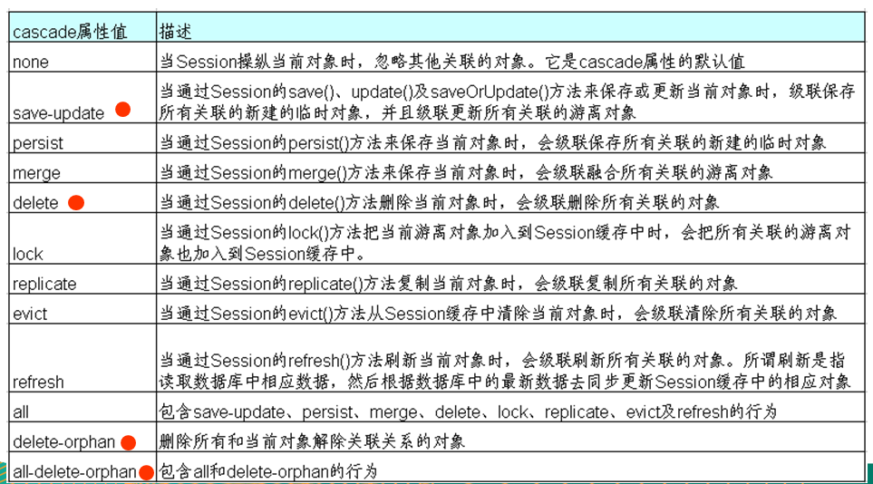
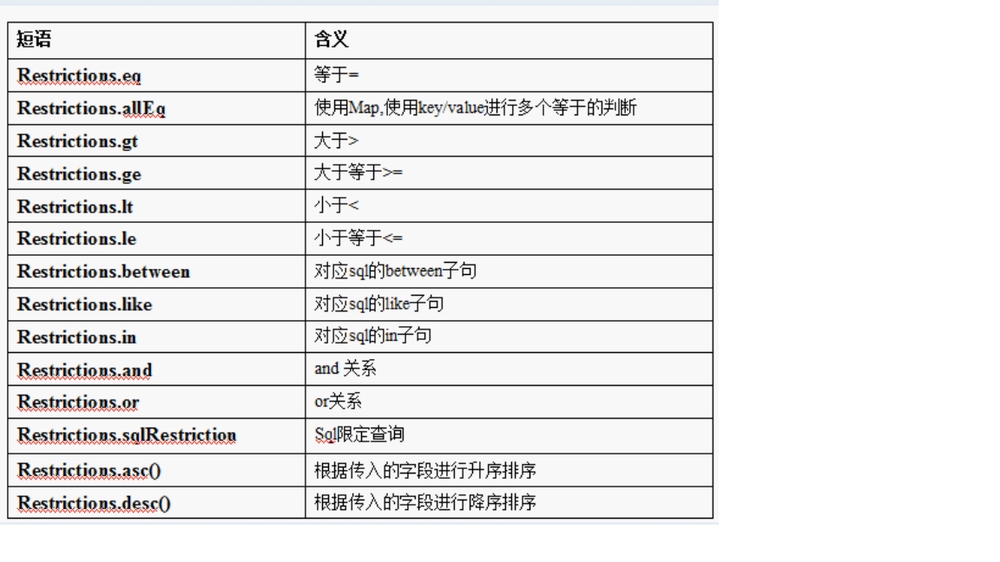
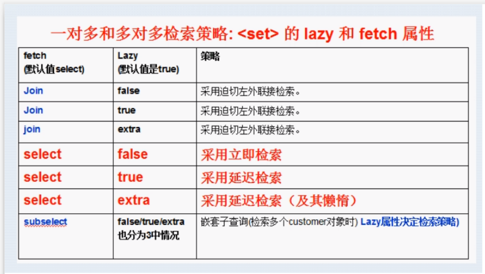

# Hibernate学习

## Hibernate基本配置

	### 实体类
```java
package com.xiao;

import lombok.Data;

@Data
public class GoodsEntity {

    public GoodsEntity() {
    }

    public GoodsEntity(String name, Double price) {
        this.name = name;
        this.price = price;
    }

    private int sid;
    private String name;
    private Double price;

}
```

### Hibernate核心配置文件 

```xml
<?xml version='1.0' encoding='utf-8'?>
<!DOCTYPE hibernate-configuration PUBLIC
        "-//Hibernate/Hibernate Configuration DTD//EN"
        "http://www.hibernate.org/dtd/hibernate-configuration-3.0.dtd">
<hibernate-configuration>
    <session-factory>
        <!--mysql账户名-->
        <property name="connection.username">root</property>
        <!--mysql密码-->
        <property name="connection.password">xiaojiebin</property>
        <!--mysql驱动-->
        <property name="connection.driver_class">com.mysql.jdbc.Driver</property>
        <!--mysql连接URL-->
        <property name="connection.url">jdbc:mysql://47.107.158.197:3306/hibernate</property>
        <!--数据库方言-->
        <property name="dialect">org.hibernate.dialect.MySQL8Dialect</property>
        <!--显示SQL语句-->
        <property name="show_sql">true</property>
        <!--格式化sql语句-->
        <property name="format_sql">true</property>
        <!--根据需要创建数据-->
        <property name="hbm2ddl.auto">update</property>
        <-- 
        hbm2ddl.auto 拥有四种值
        create：表示启动的时候先drop，在create。也就是说每次启动，会先将数据库中表给删除，然后在创建一个。开发人员测试用的比较过
        create-drop：也表示创建，只不过在系统该关闭执行以下drop。每次关闭钱九江表给删除掉，等用的时候在创键。
        update：这个操作启动的时候回去检查与映射文件是否一致，如果不一致会做映射文件的更新，就是检查hibernate中的数据库表中字段关系是够一致，不一致就会更新数据库
        validate：启动时验证现有映射文件与你配置的hibernate是否一致，如果不一致就抛出异常，并不做更新 -->
        
        <mapping resource="entity/GoodsEntity.hbm.xml"></mapping>
    </session-factory>
</hibernate-configuration>
```

### 实体类映射文件

```xml
<?xml version="1.0"?>
<!DOCTYPE hibernate-mapping PUBLIC
        "-//Hibernate/Hibernate Mapping DTD 3.0//EN"
        "http://www.hibernate.org/dtd/hibernate-mapping-3.0.dtd">
<hibernate-mapping package="com.xiao">
<-- 
	主键生成策略六种：
		1.increment：hibernate管理，自动让主键自动增长，而数据库中主键就可以不用再设置AUTO_INCREMENT了
		2.identity：底层数据库管理，也就是说数据库需要自己设置主键自动增长（AUTO_INCREMENT），不设置的话，就需要自己手动设置，mysql和SQLserver支持，oracle不支持
		3.sequence：底层数据库管理，数据库自己来提供这个主键是什么，oracle使用这种方式
		4.nvtive：hibernate不管理，让数据库底层自己选择主键如何生成，mysql默认使用identity，oracle默认使用sequence，让数据库底层自己设计序列化增长
		5.uuid：每次会给主键生辰给一个随机的32位字符串
		6.assigned：手动设置主键
-->
    <class name="GoodsEntity" table="GoodsEntity">
        <id name="sid">
            <generator class="native"></generator>
        </id>
        <property name="name" column="name"></property>
        <property name="price" column="price"></property>
    </class>
</hibernate-mapping>
```

### 测试类

```java
import com.xiao.GoodsEntity;
import org.hibernate.Session;
import org.hibernate.SessionFactory;
import org.hibernate.Transaction;
import org.hibernate.cfg.Configuration;
import org.junit.After;
import org.junit.Before;
import org.junit.Test;

public class TestGoods {
    private SessionFactory sessionFactory;
    private Session session;
    private Transaction transaction;

    /**
     * 执行test之前执行的代码
     */
    @Before
    public void init(){
        Configuration configuration=new Configuration().configure();//创建配置对象
        sessionFactory=configuration.buildSessionFactory();//创建session工厂
        session=sessionFactory.openSession();//获得session对象
        transaction = session.beginTransaction();//打开事务管理
    }
    /**
     * 执行After之后的的代码
     */
    @After
    public void destory(){
        transaction.commit();//事务提交
        session.close();//关闭会话
        sessionFactory.close();//关闭会话工厂
    }
    @Test
    public void testGoods(){
        //生成对象
        GoodsEntity goodsEntity=new GoodsEntity("女朋友",2333333.3);
        //保存对象数据库
        session.save(goodsEntity);
    }
}
```


## hibernate表关系

## 一对多

### 单向关系

​	实体类

```java
package com.xiao;

import lombok.Data;

@Data
public class Classess {

    public Classess(String name) {
        this.name = name;
    }

    private String id;
    private String name;

    public Classess() {
    }
}
```

```java
import lombok.Data;

@Data
public class Student {
    private String id;
    private String sname;

    public Student(String sname) {
        this.sname = sname;
    }

    private Classess classess;

    public Student() {
    }
}
```

​		映射文件

```xml
<?xml version="1.0"?>
<!DOCTYPE hibernate-mapping PUBLIC
        "-//Hibernate/Hibernate Mapping DTD 3.0//EN"
        "http://www.hibernate.org/dtd/hibernate-mapping-3.0.dtd">
<hibernate-mapping package="com.xiao">
    <class name="Classess" table="Classess">
        <id name="id" column="cid">
            <generator class="uuid"></generator>
        </id>
        <property name="name" column="name"></property>
    </class>
</hibernate-mapping>
```

```xml
<?xml version="1.0"?>
<!DOCTYPE hibernate-mapping PUBLIC
        "-//Hibernate/Hibernate Mapping DTD 3.0//EN"
        "http://www.hibernate.org/dtd/hibernate-mapping-3.0.dtd">
<hibernate-mapping package="com.xiao">
    <class name="Student" table="Student">
        <id name="id">
            <generator class="uuid"></generator>
        </id>

        <property name="sname" column="sname"></property>
        <!-- 
            映射多对一的关联关系。 使用 many-to-one 来映射多对一的关联关系 
            name: N端对应1端的属性名字
            class: 1端对应的类
            column: 一那一端在多的一端对应的数据表中的外键的名字
        -->
        <many-to-one name="classess" class="Classess" column="cid"/>
    </class>
</hibernate-mapping>
```

​		测试类

```java
import com.xiao.Classess;
import com.xiao.GoodsEntity;
import com.xiao.Student;
import org.hibernate.Session;
import org.hibernate.SessionFactory;
import org.hibernate.Transaction;
import org.hibernate.cfg.Configuration;
import org.junit.After;
import org.junit.Before;
import org.junit.Test;

public class TestGoods {
    private SessionFactory sessionFactory;
    private Session session;
    private Transaction transaction;

    /**
     * 执行test之前执行的代码
     */
    @Before
    public void init() {
        Configuration configuration = new Configuration().configure();//创建配置对象
        sessionFactory = configuration.buildSessionFactory();//创建session工厂
        session = sessionFactory.openSession();//获得session对象
        transaction = session.beginTransaction();//打开事务管理
    }

    /**
     * 执行After之后的的代码
     */
    @After
    public void destory() {
        transaction.commit();//事务提交
        session.close();//关闭会话
        sessionFactory.close();//关闭会话工厂
    }

    @Test
    public void testGoods() {
        //生成对象
        GoodsEntity goodsEntity = new GoodsEntity("男朋友", 5633333.3);
        //保存对象数据库
        session.save(goodsEntity);

        Classess classess = new Classess("软件一班");

        Student student1 = new Student("肖杰斌");
        Student student2 = new Student("鹿丽娟");

        student1.setClassess(classess);
        student2.setClassess(classess);

        session.save(classess);
        session.save(student1);
        session.save(student2);
    }
}
```


### 双向关系

​		实体类

```java
package com.xiao;

import lombok.Data;

import java.util.HashSet;
import java.util.Set;

@Data
public class Classess {
    public Classess() {
    }

    public Classess(String name) {
        this.name = name;
    }

    private String id;
    private String name;
    /*
     * 1. 声明集合类型时, 需使用接口类型, 因为 hibernate 在获取
     * 集合类型时, 返回的是 Hibernate 内置的集合类型, 而不是 JavaSE 一个标准的集合实现.
     * 2. 需要把集合进行初始化, 可以防止发生空指针异常
     */
    private Set<Student> student=new HashSet<>();
}

```

```jav
package com.xiao;

import lombok.Data;

@Data
public class Student {
    private String id;
    private String sname;

    public Student(String sname) {
        this.sname = sname;
    }

    private Classess classess;

    public Student() {
    }
}

```

​		映射文件

```xml
<?xml version="1.0"?>
<!DOCTYPE hibernate-mapping PUBLIC
        "-//Hibernate/Hibernate Mapping DTD 3.0//EN"
        "http://www.hibernate.org/dtd/hibernate-mapping-3.0.dtd">
<hibernate-mapping package="com.xiao">
    <class name="Classess" table="Classess">
        <id name="id" column="cid">
            <generator class="uuid"></generator>
        </id>
        <property name="name" column="name"></property>
        <!-- 映射 1 对多的那个集合属性 -->
        <!-- set: 映射 set 类型的属性, name:一的这一端关联的多的那一端的属性名,
        table: set 中的元素对应的记录放在哪一个数据表中.
        该值需要和多对一的多的那个表的名字一致 -->
        <set name="student" table="Student">
            <!-- 指定关联的表中的外键列的名字 -->
            <key column="cid"></key>
            <!-- 指定映射类型 -->
            <one-to-many class="Student"></one-to-many>
        </set>
    </class>
</hibernate-mapping>
```

```xml
<?xml version="1.0"?>
<!DOCTYPE hibernate-mapping PUBLIC
        "-//Hibernate/Hibernate Mapping DTD 3.0//EN"
        "http://www.hibernate.org/dtd/hibernate-mapping-3.0.dtd">
<hibernate-mapping package="com.xiao">
    <class name="Student" table="Student">
        <id name="id">
            <generator class="uuid"></generator>
        </id>

        <property name="sname" column="sname"></property>
        <!-- 
            映射多对一的关联关系。 使用 many-to-one 来映射多对一的关联关系 
            name: N端对应1端的属性名字
            class: 1端对应的类
            column: 一那一端在多的一端对应的数据表中的外键的名字
        -->
        <many-to-one name="classess" class="Classess" column="cid"/>
    </class>
</hibernate-mapping>
```


## 一对多级联

### 级联的添加

​		配置

```xml
<set name="orders" table="ORDERS" cascade="save-update">
```




​		测试

```java
    @Test
    public void testOne() {
        Classess r1 = new Classess("软件一班");

        Student s1 = new Student("小李子");
        Student s2 = new Student("李瘦子");

        r1.getStu().add(s1);
        r1.getStu().add(s2);

        session.save(r1);
      
    }
```

### 级联删除

```xml
<set name="orders" table="ORDERS" cascade="save-update,delete">
```

```java
   @Test
    public void testTwo(){
        Classess classess = session.get(Classess.class, "402880ea6abfcf45016abfcf49ce0000");
        session.delete(classess);
    }
```

### 级联修改

```xml
<!-- inverse true放弃维护关系 flase维护关系-->
        <set name="stu" table="T_student" cascade="save-update,delete" inverse="true">
```

```java
    @Test
    public void update(){
        Student student = session.get(Student.class, "402880ea6abfdd92016abfdd97820001");
        Classess classess = session.get(Classess.class, "402880ea6abfdd92016abfdd97650000");
        student.setClassess(classess);
    }
```


## 多对多

### 实体类

```java
package com.entity;

import lombok.Data;

import java.util.HashSet;
import java.util.Set;

@Data
public class StudentTwo {
    private Integer sid;
    private String sname;
    private Set<Course> courseSet=new HashSet<>();
}
```

```java
package com.entity;

import lombok.Data;
import java.util.HashSet;
import java.util.Set;

@Data
public class Course {
    private int cid;
    private String cname;
    private Set<StudentTwo> studentSet = new HashSet<>();
}

```

### 配置文件

```xml
<?xml version="1.0"?>
<!DOCTYPE hibernate-mapping PUBLIC
        "-//Hibernate/Hibernate Mapping DTD 3.0//EN"
        "http://www.hibernate.org/dtd/hibernate-mapping-3.0.dtd">
<hibernate-mapping>
    <class name="com.entity.StudentTwo" table="student">
        <id name="sid" column="sid">
            <generator class="increment"/>
        </id>
        <property name="sname"/>
        <!-- 要查询所有course，就需要通过连接表，所以申明连接表的名称 -->
        <set name="courseSet" table="student_course" cascade="save-update,delete">
            <!-- 本实体类在连接表中的外键名称，让hibernate知道连接表或者那个有一个外键为s_id的指向本实体类-->
            <key column="s_id"></key>
            <!-- 多对多映射管理，映射类和其映射类在连接表中的外键名名称-->
            <many-to-many class="com.entity.Course" column="c_id"></many-to-many>
        </set>
    </class>

    <class name="com.entity.Course" table="course">
        <id name="cid" column="cid">
            <generator class="increment"/>
        </id>
        <property name="cname" column="cname"></property>
        <set name="studentSet" table="student_course" cascade="save-update,delete">
            <key column="c_id"></key>
            <many-to-many column="s_id" class="com.entity.StudentTwo"></many-to-many>
        </set>
    </class>
</hibernate-mapping>
```

### 级联添加数据

```java
	/**
     * 级联添加
     */
    @Test
    public void testTree(){
        Course course = new Course();
        course.setCname("物理");
        StudentTwo student = new StudentTwo();
        student.setSname("李窝");
        student.getCourseSet().add(course);
        session.save(student);
    }
```

### 级联删除

```java
@Test
    public void testDelete(){
        Course course = session.get(Course.class, 1);
        session.delete(course);
    }
```

### 维护第三张表的关系

```java
@Test
    public void testFive(){
        Course course = session.get(Course.class, 2);
        StudentTwo studentTwo = session.get(StudentTwo.class, 3);
        course.getStudentSet().add(studentTwo);

    }

    @Test
    public void testSix(){
        Course course = session.get(Course.class, 2);
        StudentTwo studentTwo = session.get(StudentTwo.class, 3);
        course.getStudentSet().remove(studentTwo);
    }
```

## hibernate查询方式

### 对象导航查询

​	应用场景：根据ID查询某个班级，在查询这个班级里的学生

```java
    /**
     * 对象导航查询
     */
    @Test
    public void testSelect(){

        Classess classess = session.get(Classess.class, "402880ea6ac3ec5e016ac3ec619c0000");
        Set<Student> stu = classess.getStu();
        System.out.println(stu.size());
    }
```


### OID查询

​	应用场景：根据ID查询某一条记录，返回对象

```java
    @Test
    public void testSelect(){

        Classess classess = session.get(Classess.class, "402880ea6ac3ec5e016ac3ec619c0000");
        System.out.println(classess);
    }
```


### HQL查询

​	Query对象，写HQL语句实现查询

```txt
常用的HQL语句
1. 查询所有 from 实体类
2. 条件查询 from 实体类 where 实体类属性 = ?0或者:value
3. 模糊查询 from 实体类 where 实体类属性 like ?0或者:value
4. 排序查询 from 实体类 order by 实体类属性 [asc升序|desc降序]
5. 分页查询	from 实体类  (通过query设置参数，详情看代码)
6. 投影查询 select 实体类属性名称1，书体类属性名称2 from 实体类名称
7. 聚集函数查询 select count(*) from 实体类名称 | count、sum、avg、max、min
```

#### 1.查询所有

```java
	/**
     *
     * HQL查询所有数据
     */
    @Test
    public void testSelect1(){
        Query from_student_ = session.createQuery("from Student");
        List<Student> list = from_student_.list();
        for (Student student:list){
            System.out.println(student);
        }
    }
```

#### 2.条件查询

```java
	/**
     * HQL条件查询
     * 在hibernate4.1之后已经对HQL查询参数中的占位符做了改进，
     * 可以用改命名的方式修改，或者改为JPA占位符的方式。
     */
    @Test
    public void testSelect2(){
       // Query from_student_ = session.createQuery("from Student where id = ?0");
        //from_student_.setParameter(0,"402880ea6ac3ec5e016ac3ec61bc0001");
        Query from_student_ = session.createQuery("from Student where id = :id");
        from_student_.setParameter("id","402880ea6ac3ec5e016ac3ec61bc0001");
        List<Student> list = from_student_.list();
        for (Student student:list){
            System.out.println(student);
        }
    } 
```

#### 3.模糊查询

```java
	
    /**
     * HQL条件查询
     * 模糊查询
     */
    @Test
    public void testSelect2(){
        Query from_student_ = session.createQuery("from Student where sname like ?0");
        from_student_.setParameter(0,"%胖%");
        List<Student> list = from_student_.list();
        for (Student student:list){
            System.out.println(student);
        }
    }
```

#### 4.排序查询

```java

 	/**
     * HQL排序查询
     */
    @Test
    public void testSelect2(){
        Query from_student_ = session.createQuery("from Student order by id desc ");
        List<Student> list = from_student_.list();
        for (Student student:list){
            System.out.println(student);
        }
    }
```

#### 5.分页查询

```java
	/**
     * HQL分页查询
     */
    @Test
    public void testSelect3(){
        Query from_student_ = session.createQuery("from Student");
       //设置分页数据
        //设置开始位置
        from_student_.setFirstResult(0);
        //设置每页记录数
        from_student_.setMaxResults(2);
        List<Student> list = from_student_.list();
        for (Student student:list){
            System.out.println(student);
        }
    }
```

#### 6.投影查询

```java
  	/**
     * HQL投影查询
     */
    @Test
    public void testSelect4(){
        Query from_student_ = session.createQuery("select id,sname from Student");
        List<Object> list = from_student_.list();
        for (Object student:list){
            System.out.println(student.toString());
        }
    }
```

#### 7.聚集函数使用

```java
	  /**
     	* HQL聚集函数
     	*/
    @Test
    public void testSelect5() {
        Query from_student_ = session.createQuery("select count(*) from Student");
        Object o = from_student_.uniqueResult();
        System.out.println(o);
    }
```

#### 8.HQL多表查询

##### 1.内连接

```sql
SELECT * FROM classess c,t_student s WHERE c.cid=s.cid
```

```java
 @Test
    public void testSelect13() {
        Query query = session.createQuery("from Classess c inner join c.stu");
        List list = query.list();

    }
```

##### 2.迫切内连接

```txt
1. 迫切内连接和内连接底层实现是一样的
2. 区别：使用内连接返回值是一个list集合，迫切内连接返回的是对象
```

```java
    /**
     * 迫切内连接
     */
    @Test
    public void testSelect14() {
        Query query = session.createQuery("from Classess c inner join fetch c.stu");
        List list = query.list();

    }
```


##### 3.左外连接

```sql
SELECT * FROM classess c LEFT JOIN t_student s ON c.cid=s.cid  
```

```java
 @Test
    public void testSelect13() {
        Query query = session.createQuery("from Classess c left join c.stu");
        List list = query.list();

    }
```


##### 4.迫切左外连接

```txt
迫切左外连接from 实体类 C left join fetch c.字段名
```

```    java
   	/**
   	 * 迫切左外连接
     */
    @Test
    public void testSelect14() {
        Query query = session.createQuery("from Classess c left join fetch c.stu");
        List list = query.list();

    }
```

##### 5.右外连接

```sql
SELECT * FROM classess c right JOIN t_student s ON c.cid=s.cid
```

##### 

```java
 @Test
    public void testSelect13() {
        Query query = session.createQuery("from Classess c tight join c.stu");
        List list = query.list();

    }
```


### QBC查询

```txt
1.不需要写SQL语句，调用方法实现
2.操作实体类和属性
3.使用Criteria对象实现
```

**'注：此对象在5.2版本已经过时'**

	#### 1.查询所有

```java
	@Test
    public void  testSelect6(){
        Criteria criteria = session.createCriteria(Student.class);
        List<Student> list = criteria.list();
        for (Student stu:list
             ) {
            System.out.println(stu.getId()+"::"+stu.getSname()
            );
        }
    }
```

#### 2.条件查询

```java
  @Test
    public void  testSelect7(){
        Criteria criteria = session.createCriteria(Student.class);
        //使用criteria对象里面的方法设置条件值
        //首先使用add方法，表示设置条件值
        //在add方法里面实用类的方法实现条件设置，类似于cid=:cid
        criteria.add(Restrictions.eq("id","402880ea6ac3ec5e016ac3ec61bc0001"));
        List<Student> list = criteria.list();
        for (Student stu:list
        ) {
            System.out.println(stu.getId()+"::"+stu.getSname()
            );
        }
    }
```

#### 3.模糊查询

```java
 @Test
    public void  testSelect8(){
        Criteria criteria = session.createCriteria(Student.class);
        //使用criteria对象里面的方法设置条件值
        //首先使用add方法，表示设置条件值
        //在add方法里面实用类的方法实现条件设置，类似于cid=:cid
        criteria.add(Restrictions.like("sname","%胖%"));
        List<Student> list = criteria.list();
        for (Student stu:list
        ) {
            System.out.println(stu.getId()+"::"+stu.getSname()
            );
        }
    }
```

#### 4.排序查询

```java
    @Test
    public void testSelect9() {
        Criteria criteria = session.createCriteria(Student.class);
        criteria.addOrder(Order.desc("id"));
        List<Student> list = criteria.list();
        for (Student stu : list
        ) {
            System.out.println(stu.getId() + "::" + stu.getSname()
            );
        }
    }
```

#### 5.分页查询

```java
 @Test
    public void testSelect10() {
        Criteria criteria = session.createCriteria(Student.class);
        //设置分页数据
        //设置开始位置,开始位置（当前页-1）* 每页显示数
        criteria.setFirstResult(0);
        //每页显示记录数
        criteria.setMaxResults(1);
        List<Student> list = criteria.list();
        for (Student stu : list
        ) {
            System.out.println(stu.getId() + "::" + stu.getSname()
            );
        }
    }
```


#### 6.统计查询

```java

    @Test
    public void testSelect11() {
        Criteria criteria = session.createCriteria(Student.class);
        criteria.setProjection(Projections.rowCount());
        Object o= criteria.uniqueResult();
        System.out.println(o);
    }
```

#### 7.离线查询

```java
  @Test
    public void testSelect12() {
        //创建对象
        DetachedCriteria detachedCriteria = DetachedCriteria.forClass(Student.class);
        //最终执行时候需要session
        Criteria executableCriteria = detachedCriteria.getExecutableCriteria(session);
        List<Student> list = executableCriteria.list();
        for (Student stu:list
             ) {
            System.out.println(stu.getId() + "::" + stu.getSname());
        }
    }
```



### 本地查询

​	SQLQuery对象，使用普通SQL实现查询

## Hibernate检索策略

	### Hiberatenate检索分为两类

#### 1.立即查询

```txt
1.立即查询：根据ID查询，调用get方法，一调用方法就会立即发送SQL语句进行查询。
```

```java
/**
 * 立即查询
 */
@Test
    public void testSelect15(){
        //会直接发送SQL语句向数据库获取内容
        Student student = session.get(Student.class, "4028b8816ac842f7016ac84321100001");
    }
```

#### 2.延迟查询


```txt
2.延迟查询：根据ID查询，还有load方法，调用load方法不会马上发送语句查询数据，只有得到对象里面的值时候才会发送语句查询数据库。
		<1>类级别延迟：根据id查询返回实体类对象，调用load方法不会马上发送SQL语句
		<2>关联级别延迟：查询班级，通过班级查询班级学生，查询班级学生的过程是否需要延迟，这个过程称为关联级别延迟。
```


```java

/**
 * 延迟查询
 */
@Test
    public void testSelect15(){
       Student student = session.load(Student.class, "4028b8816ac842f7016ac84321100001");
        //load返回的是ID，获取ID时，不会发送SQL语句
       System.out.println(student.getId());
        //调用除ID外其他属性，会发送SQL语句
       System.out.println(student.getName());
    }

```

```java
 	/**
     * hibernate 级联延迟,默认设置
     */
    @Test
    public void testSelect16(){
        //通过get获取对象，发送SQL语句
        StudentTwo studentTwo = session.get(StudentTwo.class, 1);
        //不会发送SQL语句
        Set<Course> courseSet = studentTwo.getCourseSet();
        //获取值发送SQL语句
        System.out.println(courseSet.size());
    }
```


#### 3.关联级别延迟操作

```txt
1.在映射文件中进行配置实现
	<1>根据班级获得班级学生，在班级映射文件中高配置
2.在set标签上使用属性 lazy
	<1>fetch:值 select
	<2>lazy:值：
		-true 延迟
		-false 不延迟
		-extra 及其延迟
```

```xml
<set name="courseSet" table="student_course" cascade="save-update,delete" fetch="select" lazy="false[true|false|extra]">
```




### 批量抓取

```txt
场景：查询所有班级，得到CLASSESS的集合，获得所有班级，遍历班级获得所有学生的信息。
```

```java
	/**
     * 未优化
     */

    @Test
    public void testSelect17(){
        Query from_classess = session.createQuery("from Classess");
        List<Classess> list = from_classess.list();
        for (Classess classess:list
             ) {
           System.out.println(classess.getId()+"::"+classess.getName());
            Set<Student> stu = classess.getStu();
            for (Student stud:stu
                 ) {
                System.out.println(stud.getId()+"::"+stud.getSname());
            }
        }
    }
```

```xml
batch-size值越大，优化越好。
<set name="courseSet" table="student_course" cascade="save-update,delete" batch-size="2">
```

